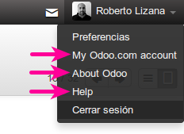
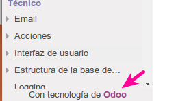
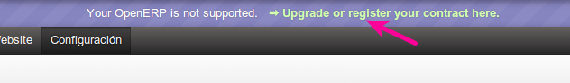

Información
===========

Este modulo elimina las referencias a Odoo de la aplicación.

**Compatible con la version OpenERP 7, OpenERP 8 trunk y Odoo master**

Elementos que modifica
----------------------

* Elimina del menú las opciones de ayuda y de información de la aplicacion. 

* Elimina el mensaje del pie

* Quitar mensaje de esta version no esta soportada

